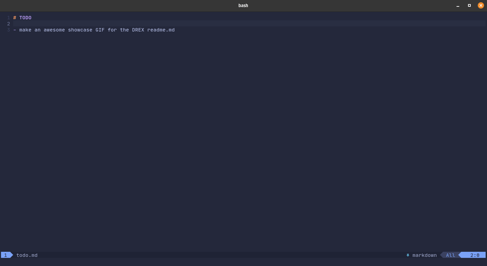
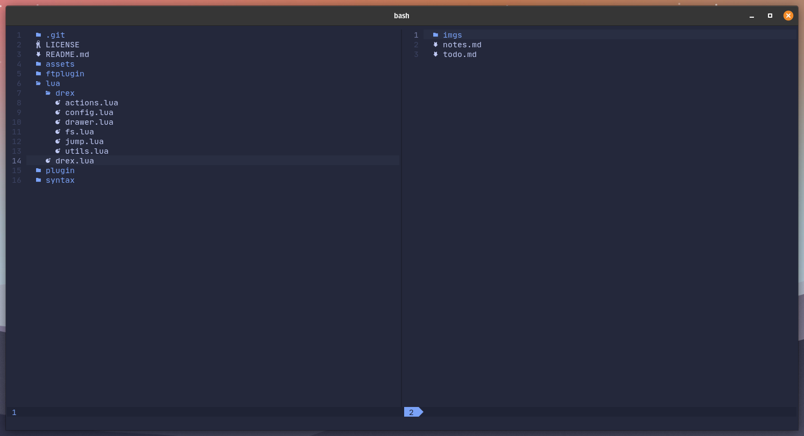
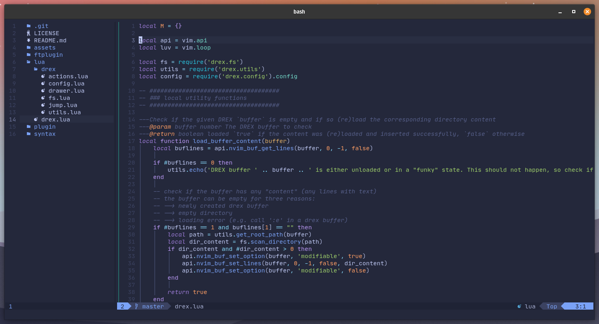
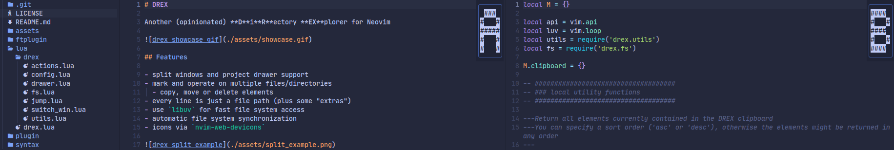

# DREX

Another (opinionated) **D**i**R**ectory **EX**plorer for Neovim

 

## Features

- split windows and project drawer support
- mark and operate on multiple files/directories
  - copy, move or delete elements
- every line is just a file path (plus some "extras")
- use `libuv` for fast file system access
- automatic file system synchronization
- icons via `nvim-web-devicons`

 

 

## Motivation

There are many awesome file/directory explorer plugins available for (Neo)VIM

- [nvim-tree]() 
- [vim-dirvish]() 
- [fern]() 
- ...

Despite all these great solutions none of them fit 100% with me as I would always find something that annoyed me or did not work the way I though it should. This with my incapability to write VimScript (and no intention to master it) lead to start this project

It takes the general approach of `vim-dirvish` (every line is just a filepath), mixes it with the utility of `fern`, put in some [libuv](https://github.com/libuv/libuv) goodness like `nvim-tree` and season it with Lua and a bunch of ideas from other plugins as well as my own. The result of these experiments is DREX

## Installation

> DREX requires Neovim version ≥ 0.5

Install DREX with your favorite plugin manager

[packer](https://github.com/wbthomason/packer.nvim) 

```lua
use {
  'theblob42/drex.nvim',
  requires = 'kyazdani42/nvim-web-devicons', -- optional
}
```

[vim-plug](https://github.com/junegunn/vim-plug) 

```vim
Plug 'kyazdani42/nvim-web-devicons' " optional
Plug 'theblob42/drex.nvim'
```

Installing [nvim-web-devicons](https://github.com/kyazdani42/nvim-web-devicons) for nice file type icons is optional and the plugins works fine without it

## Usage

To open a DREX buffer in the current working directory

```
:Drex
```

You can also provide a path to the `Drex` command

```
:Drex ~/projects
```

Furthermore `cmdline-special` characters and `filename-modifiers` are also supported  
*(for example: open the parent directory of the current file)*

```
:Drex %:h
```

> See `:h cmdline-special` and `:h expand()` and `:h filename-modifiers` for more information

DREX also comes with a simple project drawer functionality

```
:DrexDrawerOpen
```

You can also quickly jump to the current file in the drawer window

```
:DrexDrawerFindFileAndFocus
```

| Command                      | Description                                                                                                  |
| ----------------             | ---------------                                                                                              |
| `Drex`                       | Open a DREX buffer<br>Uses an optional path argument<br>Will reuse existing buffers if present               |
| `DrexDrawerOpen`             | Open the drawer window in the current working directory and focus it<br>If it is already open, just focus it |
| `DrexDrawerClose`            | Close the current drawer window                                                                              |
| `DrexDrawerToggle`           | If the drawer window is closed open it<br>If the drawer window is open close it                              |
| `DrexDrawerFindFile`         | Find the current file in the drawer window and jump to it                                                    |
| `DrexDrawerFindFileAndFocus` | Like `DrexDrawerFindFile` but also focus the drawer window                                                   |
| `DrexMark`¹                  | Mark the element under the cursor and add it to the DREX clipboard                                           |
| `DrexUnmark`¹                | Unmark the element under the cursor and remove it from the DREX clipboard                                    |
| `DrexToggle`¹                | Behaves like `DrexMark` for unmarked elements<br>Behaves like `DrexUnmark` for marked elements               |

¹In visual mode apply to all selected elements

<details style="cursor: pointer">
  <summary>Lua equivalent function calls</summary>

| Command                      | Lua                                                     |
| ----------------             | ---------------                                         |
| `Drex`                       | `require('drex').open_directory_buffer(<path>)`         |
| `DrexDrawerOpen`             | `require('drex.drawer').open()`                         |
| `DrexDrawerClose`            | `require('drex.drawer').close()`                        |
| `DrexDrawerToggle`           | `require('drex.drawer').toggle()`                       |
| `DrexDrawerFindFile`         | `require('drex.drawer').find_element('%', false, true)` |
| `DrexDrawerFindFileAndFocus` | `require('drex.drawer').find_element('%', true, true)`  |
| `DrexMark`                   | `require('drex.actions').mark(<line1>, <line2>)`        |
| `DrexUnmark`                 | `require('drex.actions').unmark(<line1>, <line2>)`      |
| `DrexToggle`                 | `require('drex.actions').toggle(<line1>, <line2>)`      |

> There are more Lua functions than VIM commands available currently
</details>

### Default Keybindings

> To see the definition of all default keybindings see the [configuration table](#configuration-table) 

DREX comes with a collection of default keybindings to for a nice "out of the box" experience

Some general information:

- Use `j` and `k` like in any other VIM buffer (no special mappings)
- `v` is mapped to `V` because there is no need for a charwise selection
- There is an autocommand which keeps the cursor in column `0` so it doesn't get lost
  - There is no "benefit" in moving the cursor to any other column for any reason

The default keybindings:

- `l` expands the current element
  - If it is a directory open its content in a sub-tree
  - If it is a file open the file in the current window¹
- `h` collapse the current directory's sub-tree
  - If the element under the cursor is an open directory collapse it
  - Otherwise collapse the parent directory of the element
- `<Right>` is just another mapping for `l`
- `<Left>` is just another mapping for `h`
- `<2-LeftMouse>` is just another mapping for `l`
- `<RightMouse>` is just another mapping for `h`
- `<C-v>` open a file in a vertical split¹
- `<C-x>` open a file in a horizontal split¹
- `<C-t>` open a file in a new tab
- `<F5>` reload the current directory (dependent on your cursor position)
- `<C-h>` open a new DREX buffer in the parent directory of the current root path
- `<C-l>` open the directory under the cursor (the parent directory if the element is a file) in a new DREX buffer
- `gj` jump to the next sibling
- `gk` jump to the previous sibling
- `gh` jump to the parent directory of the current element
- `m` mark or unmark the current element (add or remove it from the clipboard)²
- `M` mark the current element (add it to the clipboard)²
- `u` unmark the current element (remove it from the clipboard)²
- `cc` clear the clipboard content
- `cs` show the content of the clipboard
- `s` show the stats for the element under the cursor
- `a` create a new file or directory
  - to add a directory add a `/` at the end of your input
  - you can create multiple new directories during creation<br>(e.g. `foo/bar/file` will create `foo` and `bar` if they don't exist as well as `file`)
- `d` delete the element under the cursor (or the visual selection)
- `D` delete all files and directories which are contained in the clipboard
- `p` copy all files and directories from the clipboard to the path under the cursor
  - this will **not** clear the clipboard, so you can continue pasting those files elsewhere
- `P` move the files and directories from their current location to the path under the cursor
- `r` rename the element under the cursor
  - you can also use this to move an element to another location
  - you can create multiple new directories during renaming<br>(e.g. `foo/bar/blob` will create `foo` and `bar` if they don't exist and rename the element to `blob`)
- `y` copy the name of the element under the cursor³
- `Y` copy the relative path of the element under the cursor (including the elements name)³
- `<C-y>` copy the absolute path of the element under the cursor (including the elements name)³

¹If the current window is the drawer window execute the command from the previous window (`wincmd p`)  
²In visual mode this affects all selected elements  
³In visual mode the corresponding values from all selected elements are copied (separated by `\n`)

## Configuration

There is no initial setup needed to use DREX. However you may pass a configuration table to `require('drex.config').configure()` in order to adapt the defaults to your liking. See the default configuration values as well as the structure of the configuration table

<a name="configuration-table"></a>
```lua
{
    icons = {
        dir_open = "",
        dir_closed = "",
        file_default = "🗎",
    },
    drawer = {
        default_width = 30,
        window_picker = {
            enabled = true,
            labels = 'abcdefghijklmnopqrstuvwxyz',
        },
    },
    disable_default_keybindings = false,
    keybindings = {
        ['n'] = {
            -- always use visual mode linewise for better visibility
            ['v'] = 'V',
            -- open/close directories
            ['l'] = '<cmd>lua require("drex").expand_element()<CR>',
            ['h'] = '<cmd>lua require("drex").collapse_directory()<CR>',
            ['<right>'] = '<cmd>lua require("drex").expand_element()<CR>',
            ['<left>']  = '<cmd>lua require("drex").collapse_directory()<CR>',
            ['<2-LeftMouse>'] = '<LeftMouse><cmd>lua require("drex").expand_element()<CR>',
            ['<RightMouse>']  = '<LeftMouse><cmd>lua require("drex").collapse_directory()<CR>',
            -- open files in separate windows/tabs
            ['<C-v>'] = '<cmd>lua require("drex").open_file("vs")<CR>',
            ['<C-x>'] = '<cmd>lua require("drex").open_file("sp")<CR>',
            ['<C-t>'] = '<cmd>lua require("drex").open_file("tabnew")<CR>',
            -- switch root directory
            ['<C-l>'] = '<cmd>lua require("drex").open_directory()<CR>',
            ['<C-h>'] = '<cmd>lua require("drex").open_parent_directory()<CR>',
            -- manual reload
            ['<F5>'] = '<cmd>lua require("drex").reload_directory()<CR>',
            -- jump around elements
            ['gj'] = '<cmd>lua require("drex.jump").jump_to_next_sibling()<CR>',
            ['gk'] = '<cmd>lua require("drex.jump").jump_to_prev_sibling()<CR>',
            ['gh'] = '<cmd>lua require("drex.jump").jump_to_parent()<CR>',
            -- file actions
            ['s'] = '<cmd>lua require("drex.actions").stats()<CR>',
            ['a'] = '<cmd>lua require("drex.actions").create()<CR>',
            ['d'] = '<cmd>lua require("drex.actions").delete("line")<CR>',
            ['D'] = '<cmd>lua require("drex.actions").delete("clipboard")<CR>',
            ['p'] = '<cmd>lua require("drex.actions").copy_and_paste()<CR>',
            ['P'] = '<cmd>lua require("drex.actions").cut_and_move()<CR>',
            ['r'] = '<cmd>lua require("drex.actions").rename()<CR>',
            -- add/remove elements from clipboard
            ['M'] = '<cmd>DrexMark<CR>',
            ['u'] = '<cmd>DrexUnmark<CR>',
            ['m'] = '<cmd>DrexToggle<CR>',
            ['cc'] = '<cmd>lua require("drex.actions").clear_clipboard()<CR>',
            ['cs'] = '<cmd>lua require("drex.actions").print_clipboard()<CR>',
            -- string copy utilities
            ['y'] = '<cmd>lua require("drex.actions").copy_element_name()<CR>',
            ['Y'] = '<cmd>lua require("drex.actions").copy_element_relative_path()<CR>',
            ['<C-y>'] = '<cmd>lua require("drex.actions").copy_element_absolute_path()<CR>',
        },
        ['v'] = {
            -- file actions
            ['d'] = ':lua require("drex.actions").delete("visual")<CR>',
            -- add/remove elements from clipboard
            ['M'] = ':DrexMark<CR>',
            ['u'] = ':DrexUnmark<CR>',
            ['m'] = ':DrexToggle<CR>',
            -- string copy utilities
            ['y'] = ':lua require("drex.actions").copy_element_name(true)<CR>',
            ['Y'] = ':lua require("drex.actions").copy_element_relative_path(true)<CR>',
            ['<C-y>'] = ':lua require("drex.actions").copy_element_absolute_path(true)<CR>',
        }
    },
    on_enter = nil,
    on_leave = nil,
}
```

### Icons

| Option           | Description                                                   | Default         |
| ---------------- | ---------------                                               | --------------- |
| `dir_closed`     | icon for a closed directory                                   | ``             |
| `dir_open`       | icon for an open directory                                    | ``             |
| `file_default`   | default file icon if `nvim-web-devicons` is **not** installed | `🗎`             |

> If you don't see the (correct) default icons you need to install a [NerdFont](https://www.nerdfonts.com/) 

### Drawer

| Option           | Description                                            | Default                      |
| ---------------- | ---------------                                        | ---------------              |
| `default_width`  | the default width for the drawer window                | `30`                         |
| `window_picker`  | configuration for the window picker functionality      | -                            |
| >> `enabled`     | automatically used when opening files from drawer\*    | `true`                       |
| >> `labels`      | labels used for the window picker (from left to right) | `abcdefghijklmnopqrstuvwxyz` |

\* (otherwise uses `wincmd p`)


*window picker in action*

### Keybindings

> This section is only about configuring the keybindings inside a DREX buffer  
> For more information about the provided defaults see [Default Keybindings](#default-keybindings) 

DREX comes with a set of default keybindings for a pleasant "out of the box" experience  
However you can easily add, change or disable all keybindings exactly how you like it

To add or overwrite an existing keybinding

```lua
keybindings = {
    ['n'] = {
        ['o'] = '<cmd>YourCommand<cr>',
        ['O'] = function()
            -- functions are also possible
        end,
    }
}
```

To disable a specific default keybinding

```lua
keybindings = {
    ['n'] = {
        ['o'] = false
    }
}
```

To disable **ALL** default keybindings

```lua
disable_default_keybindings = true
```

### Callbacks

| Option           | Description                                      | Default         |
| ---------------- | ---------------                                  | --------------- |
| `on_enter`       | fn to call whenever a DREX buffer enters a window | `nil`           |
| `on_leave`       | fn to call whenever a DREX buffer leaves a window | `nil`           |

These functions are especially useful to set window specific options for buffers

```lua
-- e.g. hide line numbers for DREX buffers
require('drex.config').configure {
    on_enter = function()
        vim.wo.number = false
    end,
    on_leave = function()
        vim.wo.number = true
    end,
}
```

## Customization

If you miss a certain functionality or have a very specific use case there is a fair chance that you can come up with an easy solution to your problem

Every line in a DREX buffer is just an absolute file path (plus some "extras" like indentation and icons) which is hidden via `conceal` (try `set conceallevel=0`). To easily access different parts of an element such as name, path, icon etc. there are several utility functions that you can find in `lua/drex/utils.lua`

**For a better understanding here are some code examples**

Open the element under the cursor with the default application

```lua
function open_with_default()
    local path = require('drex.utils').get_element(vim.api.nvim_get_current_line())
    vim.fn.jobstart("xdg-open '" .. path .. "' &", { detach = true })
end
```

> On MacOS or Windows you probably have to use the `open` or `start` command

Open a terminal buffer in the current path 

```lua
function open_terminal()
    vim.cmd('vsplit') -- open the terminal buffer in a new window
    local path = require('drex.utils').get_path(vim.api.nvim_get_current_line())
    local buffer = vim.api.nvim_create_buf(true, false)
    vim.api.nvim_win_set_buf(0, buffer)
    vim.fn.termopen(vim.o.shell, { cwd = path })
end
```

If you need help to implement your idea please open an issue

## Todo

DREX is not feature complete as there are still some issues and missing features I would like to tackle

- [ ] VIM doc
- [ ] Windows support (currently the path separator is hard coded to `/`)
- [ ] rework the highlighting groups
- [X] window picker functionality for opening a file from the drawer window
- [ ] toggle hidden files
- [ ] rename multiple selected elements at once (similar to [vim-renamer](https://github.com/qpkorr/vim-renamer))
- [ ] make the clipboard more interactive (e.g. remove single entries from it)
- [ ] optionally integrate with [nui.nvim](https://github.com/MunifTanjim/nui.nvim) 
- [ ] optionally integrate with [nvim-notify](https://github.com/rcarriga/nvim-notify) 
- [ ] ...

> Note that these are ideas from the top of my heads and are subject to change  
> Please also keep in mind that I'm developing this in my free time therefore priorities might change

If you encounter a bug or miss a feature please open an issue and lets discuss about it

## Miscellaneous

If you like the `window_picker` functionality from the drawer just have a look at its implementation in `./lua/drex/switch_win.lua`  
The file is structured so that could easily extract it and use within your own config or plugin with just a few simple modifications
