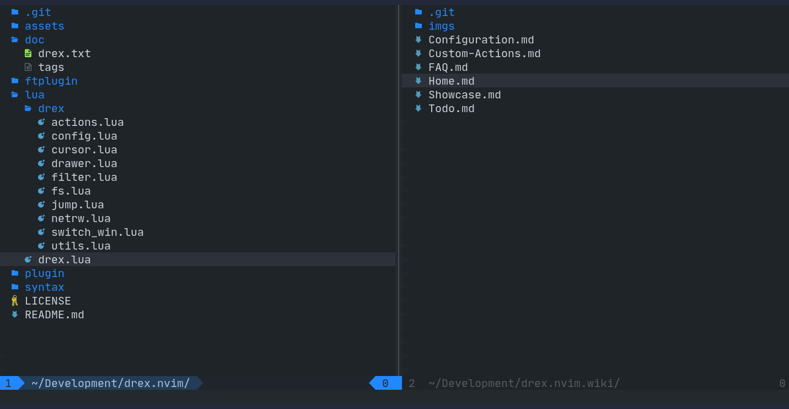

# DREX

Another **D**i**R**ectory **EX**plorer for Neovim


For showcase GIFs see [here](https://github.com/TheBlob42/drex.nvim/wiki/Showcase)

- easily navigate through your file system
- split window and project drawer support
- add, copy, move, rename and delete elements
- mark and operate on multiple elements
- automatic file system synchronization
- powered by [libuv](https://github.com/luvit/luv/blob/master/docs.md)

## Installation

> DREX requires Neovim version ≥ 0.7

Install DREX with your favorite plugin manager

[packer](https://github.com/wbthomason/packer.nvim)

```lua
use {
  'theblob42/drex.nvim',
  requires = 'kyazdani42/nvim-web-devicons', -- optional
}
```

[vim-plug](https://github.com/junegunn/vim-plug)

```vim
Plug 'theblob42/drex.nvim'
Plug 'kyazdani42/nvim-web-devicons' " optional
```

You only need to install [nvim-web-devicons](https://github.com/kyazdani42/nvim-web-devicons) if you like to have nice file type icons. The plugin works fine without it.

## Usage

Open a DREX buffer in the current working directory

```
:Drex
```

You can also provide a target path

```
:Drex ~/projects
```

To open the parent directory of the current file

```
:Drex %:h
```

> Check the manual for `cmdline-special` and `filename-modifiers`

DREX also comes with a simple project drawer functionality

```
:DrexDrawerOpen
```

> See `:help drex-commands` for more available commands

### Default Keybindings

> To see the definition of all default keybindings see the [configuration](#configuration) section

- Use `j` and `k` like in any other VIM buffer to navigate up and down
- `v` is mapped to `V` because there is no need for charwise selection

**Basic navigation**

- `l` expands the current element
  - If it is a directory open its content in a subtree
  - If it is a file open the file in the current window
    > `<Right>` and `<2-LeftMouse>` are alternative keybindings
- `h` collapses the current directories subtree
  - If the element under the cursor is an open directory collapse it
  - Otherwise collapse the parent directory of the element
    > `<Left>` and `<RightMouse>` are alternative keybindings
- `<C-v>` opens a file in a vertical split
- `<C-x>` opens a file in a horizontal split
- `<C-t>` opens a file in a new tab
- `<F5>` reloads the current directory (dependent on the cursor position)
- `<C-h>` opens a new DREX buffer in the parent directory of the current root
- `<C-l>` opens the directory under the cursor in a new DREX buffer

**Jumping**

- `gj` jumps to the next sibling
- `gk` jumps to the previous sibling
- `gh` jumps to the parent directory of the current element

**Clipboard**

- `m` marks or unmarks the current element (add or remove it from the clipboard)
- `M` marks the current element (add it to the clipboard)
- `u` unmarks the current element (remove it from the clipboard)
- `cc` clears the clipboard content
- `cs` to show and edit the content of the clipboard in a floating window

**File actions**

- `s` shows the stats for the current element
- `a` creates a new file or directory
  - to create a new directory end your input with a `/` (`\` on Windows)
  - non-existent parent directories will be created
    (e.g. `foo/bar/file` will create `foo` and `bar` if they don't exist yet)
- `d` deletes the element under the cursor (or the visual selection)
- `D` deletes all elements currently contained in the clipboard
- `p` copies all elements from the clipboard to the path under the cursor
  - this will NOT clear the clipboard, so you can continue to paste elsewhere
- `P` moves all elements from the clipboard to the path under the cursor
- `r` renames the element under the cursor (or the visual selection)
  - this can move the element to another location
  - non-existent parent directories will be created
    (e.g. `foo/bar/file` will create `foo` and `bar` if they don't exist yet)
- `R` to multi rename all elements from the clipboard

**Search**

- `/` search for visible elements (see `:help drex-search`)

**Copy strings**

- `y` copies the name of the element under the cursor
- `Y` copies the relative path of the element under the cursor
- `<C-Y>` copies the absolute path of the element under the cursor

> In visual mode these copy all selected elements (separated by "\n")

## Configuration

There is no initial setup needed to use DREX  
However you may configure certain settings to your liking

Check out `:help drex-configuration` for more details about the individual options  
See also the wiki pages about [configuration](https://github.com/TheBlob42/drex.nvim/wiki/Configuration) and [custom actions](https://github.com/TheBlob42/drex.nvim/wiki/Custom-Actions) for more information about further customization

<details>
<summary>Have a look at the default configuration</summary>

```lua
require('drex.config').configure {
    icons = {
        file_default = "",
        dir_open = "",
        dir_closed = "",
        link = "",
        others = "",
    },
    colored_icons = true,
    hide_cursor = true,
    hijack_netrw = false,
    keepalt = false,
    sorting = function(a, b)
        local aname, atype = a[1], a[2]
        local bname, btype = b[1], b[2]

        local aisdir = atype == 'directory'
        local bisdir = btype == 'directory'

        if aisdir ~= bisdir then
            return aisdir
        end

        return aname < bname
    end,
    drawer = {
        side = 'left',
        default_width = 30,
        window_picker = {
            enabled = true,
            labels = 'abcdefghijklmnopqrstuvwxyz',
        },
    },
    actions = {
      files = {
        delete_cmd = nil,
      },
    },
    disable_default_keybindings = false,
    keybindings = {
        ['n'] = {
            ['v'] = 'V',
            ['l'] = { '<cmd>lua require("drex.elements").expand_element()<CR>', { desc = 'expand element' }},
            ['h'] = { '<cmd>lua require("drex.elements").collapse_directory()<CR>', { desc = 'collapse directory' }},
            ['<right>'] = { '<cmd>lua require("drex.elements").expand_element()<CR>', { desc = 'expand element' }},
            ['<left>']  = { '<cmd>lua require("drex.elements").collapse_directory()<CR>', { desc = 'collapse directory'}},
            ['<2-LeftMouse>'] = { '<LeftMouse><cmd>lua require("drex.elements").expand_element()<CR>', { desc = 'expand element' }},
            ['<RightMouse>']  = { '<LeftMouse><cmd>lua require("drex.elements").collapse_directory()<CR>', { desc = 'collapse directory' }},
            ['<C-v>'] = { '<cmd>lua require("drex.elements").open_file("vs")<CR>', { desc = 'open file in vsplit' }},
            ['<C-x>'] = { '<cmd>lua require("drex.elements").open_file("sp")<CR>', { desc = 'open file in split' }},
            ['<C-t>'] = { '<cmd>lua require("drex.elements").open_file("tabnew", true)<CR>', { desc = 'open file in new tab' }},
            ['<C-l>'] = { '<cmd>lua require("drex.elements").open_directory()<CR>', { desc = 'open directory in new buffer' }},
            ['<C-h>'] = { '<cmd>lua require("drex.elements").open_parent_directory()<CR>', { desc = 'open parent directory in new buffer' }},
            ['<F5>'] = { '<cmd>lua require("drex").reload_directory()<CR>', { desc = 'reload' }},
            ['gj'] = { '<cmd>lua require("drex.actions.jump").jump_to_next_sibling()<CR>', { desc = 'jump to next sibling' }},
            ['gk'] = { '<cmd>lua require("drex.actions.jump").jump_to_prev_sibling()<CR>', { desc = 'jump to prev sibling' }},
            ['gh'] = { '<cmd>lua require("drex.actions.jump").jump_to_parent()<CR>', { desc = 'jump to parent element' }},
            ['s'] = { '<cmd>lua require("drex.actions.stats").stats()<CR>', { desc = 'show element stats' }},
            ['a'] = { '<cmd>lua require("drex.actions.files").create()<CR>', { desc = 'create element' }},
            ['d'] = { '<cmd>lua require("drex.actions.files").delete("line")<CR>', { desc = 'delete element' }},
            ['D'] = { '<cmd>lua require("drex.actions.files").delete("clipboard")<CR>', { desc = 'delete (clipboard)' }},
            ['p'] = { '<cmd>lua require("drex.actions.files").copy_and_paste()<CR>', { desc = 'copy & paste (clipboard)' }},
            ['P'] = { '<cmd>lua require("drex.actions.files").cut_and_move()<CR>', { desc = 'cut & move (clipboard)' }},
            ['r'] = { '<cmd>lua require("drex.actions.files").rename()<CR>', { desc = 'rename element' }},
            ['R'] = { '<cmd>lua require("drex.actions.files").multi_rename("clipboard")<CR>', { desc = 'rename (clipboard)' }},
            ['/'] = { '<cmd>keepalt lua require("drex.actions.search").search()<CR>', { desc = 'search' }},
            ['M'] = { '<cmd>DrexMark<CR>', { desc = 'mark element' }},
            ['u'] = { '<cmd>DrexUnmark<CR>', { desc = 'unmark element' }},
            ['m'] = { '<cmd>DrexToggle<CR>', { desc = 'toggle element' }},
            ['cc'] = { '<cmd>lua require("drex.clipboard").clear_clipboard()<CR>', { desc = 'clear clipboard' }},
            ['cs'] = { '<cmd>lua require("drex.clipboard").open_clipboard_window()<CR>', { desc = 'edit clipboard' }},
            ['y'] = { '<cmd>lua require("drex.actions.text").copy_name()<CR>', { desc = 'copy element name' }},
            ['Y'] = { '<cmd>lua require("drex.actions.text").copy_relative_path()<CR>', { desc = 'copy element relative path' }},
            ['<C-y>'] = { '<cmd>lua require("drex.actions.text").copy_absolute_path()<CR>', { desc = 'copy element absolute path' }},
        },
        ['v'] = {
            ['d'] = { ':lua require("drex.actions.files").delete("visual")<CR>', { desc = 'delete elements' }},
            ['r'] = { ':lua require("drex.actions.files").multi_rename("visual")<CR>', { desc = 'rename elements' }},
            ['M'] = { ':DrexMark<CR>', { desc = 'mark elements' }},
            ['u'] = { ':DrexUnmark<CR>', { desc = 'unmark elements' }},
            ['m'] = { ':DrexToggle<CR>', { desc = 'toggle elements' }},
            ['y'] = { ':lua require("drex.actions.text").copy_name(true)<CR>', { desc = 'copy element names' }},
            ['Y'] = { ':lua require("drex.actions.text").copy_relative_path(true)<CR>', { desc = 'copy element relative paths' }},
            ['<C-y>'] = { ':lua require("drex.actions.text").copy_absolute_path(true)<CR>', { desc = 'copy element absolute paths' }},
        }
    },
    on_enter = nil,
    on_leave = nil,
}
```

</details>

## Internals

Like [vim-dirvish](https://github.com/justinmk/vim-dirvish) every line is just a file path hidden via `conceal` (plus indentation and an icon). For file system scanning, file interactions (add, delete, rename, etc.) and monitoring DREX uses [libuv](https://github.com/libuv/libuv) which is exposed via `vim.loop`

See also `:help drex-customization` and the [Wiki](https://github.com/TheBlob42/drex.nvim/wiki) for more information and examples

## Contributing

Contributions are very welcome :-) doesn't matter if it's a bug, a new feature or an addition/change to the wiki. Just go ahead and open an issue or a pull-request to kick off the discussion about it

In regards to code changes and pull-requests please consider the following points:

- follow the [conventional commits](https://www.conventionalcommits.org/en/v1.0.0/) guidelines for your commit messages
- make sure you're code is properly formatted using [StyLua](https://github.com/JohnnyMorganz/StyLua)
  - make sure you have the `lua52` version installed, otherwise there will be problems with `goto` statements (see [here](https://github.com/JohnnyMorganz/StyLua/issues/407))

## Credit

- [nvim-tree](https://github.com/kyazdani42/nvim-tree.lua)
- [vim-dirvish](https://github.com/justinmk/vim-dirvish)
- [fern](https://github.com/lambdalisue/fern.vim)
